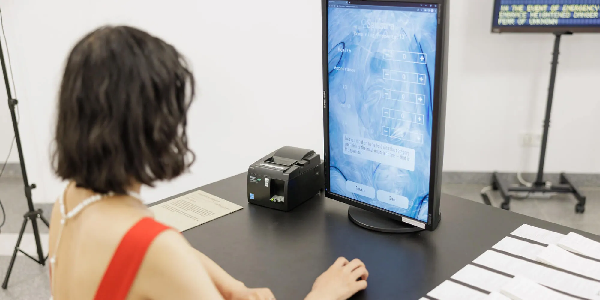

# Samsara

[](https://www.youtube.com/watch?v=SZAssoQM8Og)

♀Samsara (2022) challenges the socioeconomic frameworks woven within our optimism about gender equality. By allowing each audience to become digitally reborn as a female in the program based on their life choices, it draws attention to the parallels between the myth of meritocracy and the myth of progress, asking us to reconsider the power dynamics in the future tense. The work ushers in a sense of a future techno-dystopia where our desires are serviced by AI and human rights are sacrificed in the name of the new techno-religion.

Read more at [Planet B Exhibition at Ars Eletronica](https://ars.electronica.art/planetb/en/samsara/).


## Installation

<details>
<summary><strong>Web Version</strong></summary>
<br />

1. Installation dependence.

```bash
yarn install
```

Or

```bash
npm install
```

2. Start local server.

```bash
yarn dev
```

Or

```bash
npm run dev
```

3. After the startup is complete, will automatically open a browser and visit.
</details>

<details>
<summary><strong>Command Line Version</strong></summary>
<br />

```bash
node repl
```

</details>


## Credits

- Story design: <a href='https://www.imdb.com/name/nm14776446/'>Yuwei Jiang</a>

- Developer: Yao Wang

- Audio design: Guanyu Xie

- Code modified from Life Restart https://liferestart.syaro.io/
